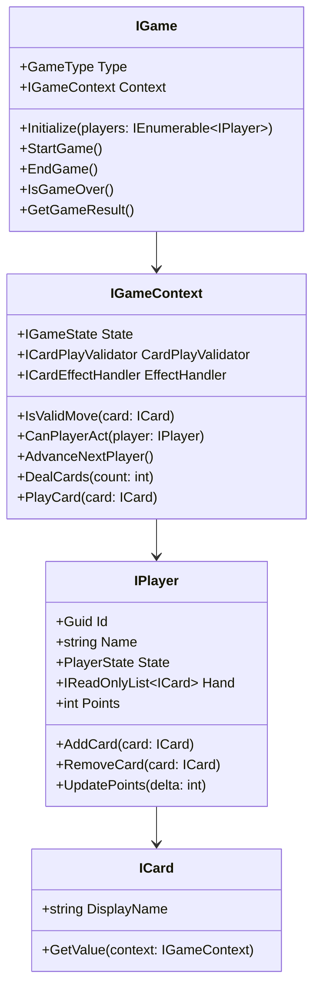
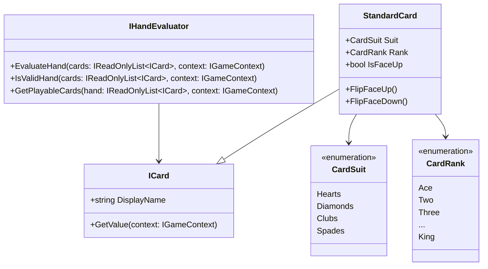
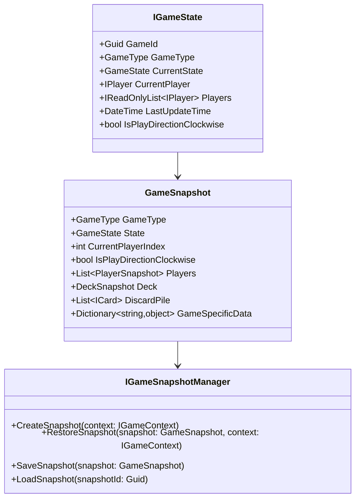

# Card Games Framework

A flexible and extensible .NET framework for implementing various card games using Clean Architecture and Domain-Driven Design principles. The framework currently supports multiple card games including Blackjack, Poker, Uno, and Baccarat.

## Architecture Overview

This project follows Clean Architecture principles with Domain-Driven Design (DDD) at its core. The solution is structured in layers, with clear separation of concerns and dependencies flowing inward.

### Project Structure

```
src/
├── BellotaLabInterview.Core/           # Core Domain Layer
│   ├── Domain/                         # Domain Models and Interfaces
│   │   ├── Cards/                      # Card-related domain objects
│   │   ├── Game/                       # Game-related domain objects
│   │   ├── Players/                    # Player-related domain objects
│   │   └── Snapshots/                  # Game state snapshot system
│   └── Services/                       # Domain Services
├── BellotaLabInterview.Infrastructure/ # Infrastructure Layer
│   └── DependencyInjection/           # DI Configuration
├── Game-Specific Implementations/      # Individual Game Implementations
│   ├── BellotaLabInterview.Blackjack/
│   ├── BellotaLabInterview.Poker/
│   ├── BellotaLabInterview.Uno/
│   └── BellotaLabInterview.Baccarat/
└── BellotaLabInterview.UI.Console/    # Presentation Layer
```

### Architectural Patterns

1. **Clean Architecture**
   - Core Domain is independent of external concerns
   - Dependencies flow inward
   - Interfaces defined in the domain layer
   - Implementations provided in outer layers

2. **Domain-Driven Design (DDD)**
   - Rich domain model with business logic
   - Value Objects for immutable concepts
   - Aggregates for consistency boundaries
   - Domain Events for cross-boundary communication

3. **SOLID Principles**
   - Single Responsibility Principle
   - Open/Closed Principle
   - Liskov Substitution Principle
   - Interface Segregation Principle
   - Dependency Inversion Principle

### Design Patterns Used

1. **Template Method Pattern**
   - `GameBase` abstract class provides the skeleton algorithm for game flow
   - Specific games override methods like `ValidatePlayers`, `InitializeGameState`, `DealInitialCards`
   - Ensures consistent game lifecycle while allowing game-specific variations

2. **Strategy Pattern**
   - `IHandEvaluator` for different card evaluation strategies
   - `ICardPlayValidator` for game-specific card play rules
   - Easily swap strategies without modifying game logic

3. **Observer Pattern**
   - Game state changes notify interested components
   - Players receive updates about game progression
   - UI components react to game state changes

4. **Factory Pattern**
   - `ICardFactory` creates game-specific card implementations
   - Encapsulates card creation logic
   - Supports different card types for different games

5. **Memento Pattern**
   - `GameSnapshot` system for saving/restoring game state
   - Enables undo/redo functionality
   - Supports game serialization and persistence

6. **Command Pattern**
   - Player actions are encapsulated as commands
   - Enables action validation, logging, and undo/redo
   - Simplifies implementation of complex game rules

### Extending the Framework

#### Creating a New Card Game

1. **Create a New Project**
   ```
   BellotaLabInterview.[GameName]/
   ├── Cards/
   │   ├── [GameName]Card.cs
   │   └── [GameName]CardFactory.cs
   ├── Game/
   │   ├── [GameName]Game.cs
   │   ├── [GameName]GameContext.cs
   │   └── [GameName]GameRules.cs
   └── Services/
       └── [GameName]GameService.cs
   ```

2. **Implement Core Interfaces**
   - Extend `GameBase` for game flow
   - Implement `IHandEvaluator` for card evaluation
   - Create game-specific card types if needed

3. **Define Game Rules**
   ```csharp
   public class [GameName]GameRules : GameRulesBase
   {
       public override int MinPlayers => [number];
       public override int MaxPlayers => [number];
       public override int InitialHandSize => [number];
       
       public override Task<bool> IsValidMove(IPlayer player, ICard card, IGameContext context)
       {
           // Implement game-specific move validation
       }
       
       // Override other methods as needed
   }
   ```

4. **Register Dependencies**
   ```csharp
   services.AddScoped<IGame, [GameName]Game>();
   services.AddScoped<IGameRules, [GameName]GameRules>();
   services.AddScoped<IHandEvaluator, [GameName]HandEvaluator>();
   ```

#### Best Practices for Extensions

1. **Domain Model Extension**
   - Keep game-specific logic in game-specific projects
   - Use composition over inheritance when possible
   - Create specialized value objects for game-specific concepts

2. **State Management**
   - Use the snapshot system for game state persistence
   - Implement game-specific serialization if needed
   - Keep state transitions explicit and validated

3. **Validation and Rules**
   - Implement comprehensive rule validation
   - Use the strategy pattern for complex rule sets
   - Keep validation logic separate from game flow

4. **Event Handling**
   - Use domain events for cross-boundary communication
   - Implement game-specific event handlers
   - Keep event handlers focused and single-purpose

5. **Testing**
   - Create game-specific test suites
   - Test edge cases and rule variations
   - Use snapshot testing for complex game states

### Example: Implementing a New Game

Here's a minimal example of implementing a new card game:

```csharp
// Game implementation
public class NewGame : GameBase
{
    public NewGame(
        IGameContext context,
        ICardFactory cardFactory,
        IHandEvaluator handEvaluator,
        IDeck deck)
        : base(GameType.NewGame, context, cardFactory, handEvaluator, deck)
    {
    }

    protected override async Task<bool> ValidatePlayers(IReadOnlyList<IPlayer> players)
    {
        return players.Count >= 2 && players.Count <= 4;
    }

    protected override async Task InitializeGameState(IReadOnlyList<IPlayer> players)
    {
        // Initialize game-specific state
    }

    protected override async Task DealInitialCards()
    {
        // Deal initial cards according to game rules
    }

    // Implement other required methods
}

// Rules implementation
public class NewGameRules : GameRulesBase
{
    public override async Task<bool> IsValidMove(IPlayer player, ICard card, IGameContext context)
    {
        // Implement move validation logic
        return true;
    }

    public override async Task<bool> IsGameOver(IGameContext context)
    {
        // Implement game over conditions
        return false;
    }
}
```

## Class Diagrams

### Core Domain Model



### Card System



### Game State Management



## Getting Started

1. Clone the repository
2. Open the solution in Visual Studio 2022 or later
3. Restore NuGet packages
4. Build the solution
5. Run the Console UI project to start playing

## Requirements

- .NET 9.0
- Visual Studio 2022 or later

## Contributing

1. Fork the repository
2. Create a feature branch
3. Commit your changes
4. Push to the branch
5. Create a Pull Request

## License

This project is licensed under the MIT License - see the LICENSE file for details