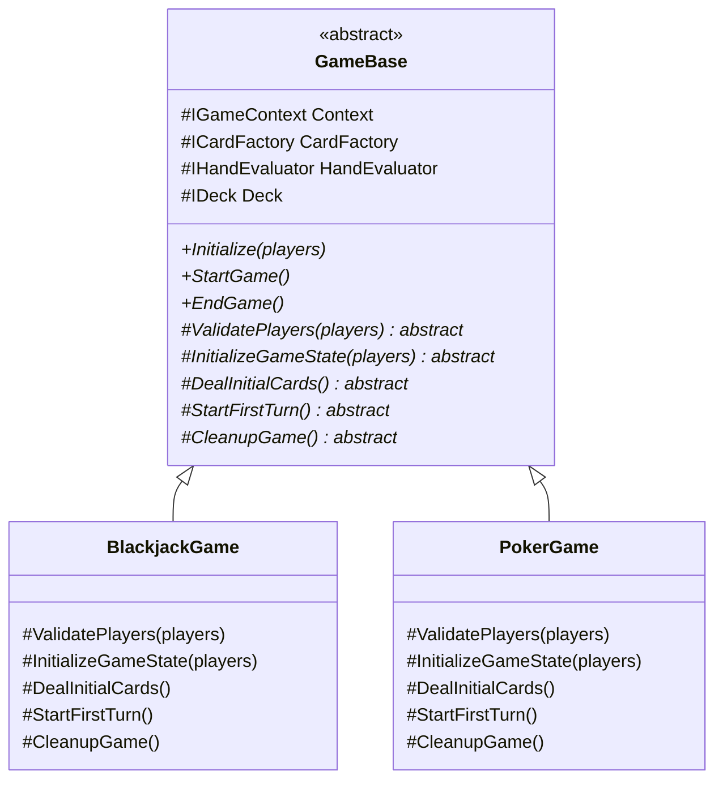
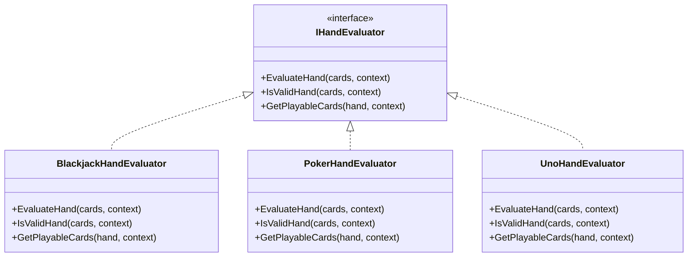
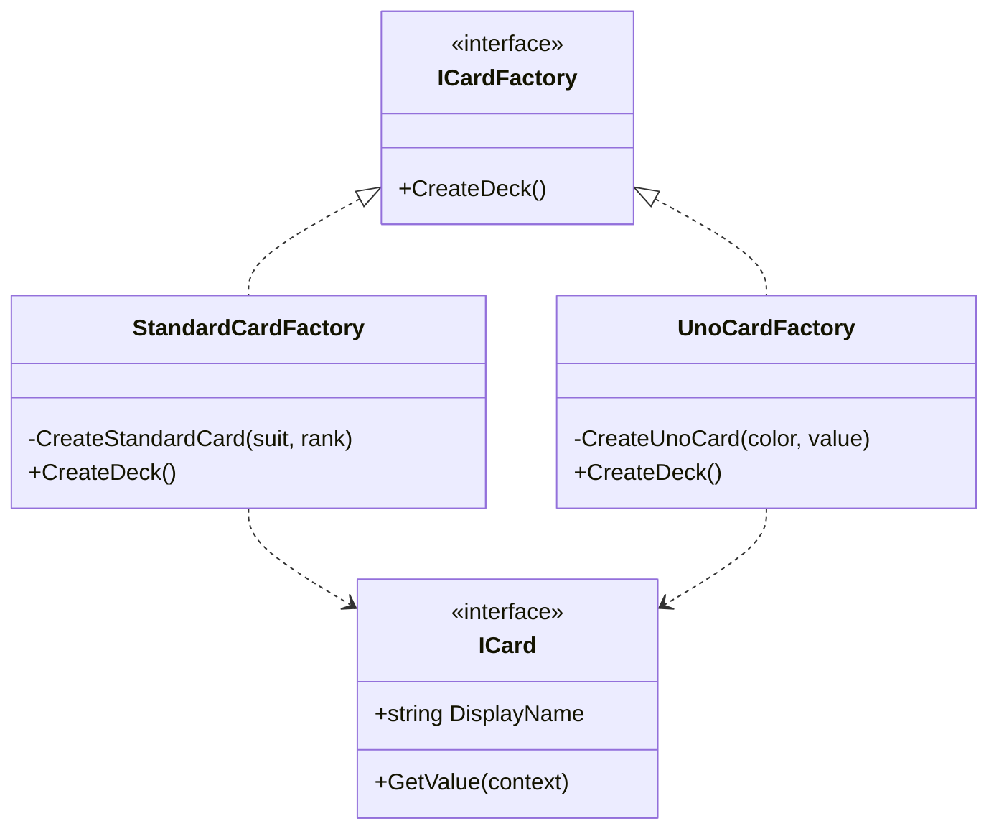
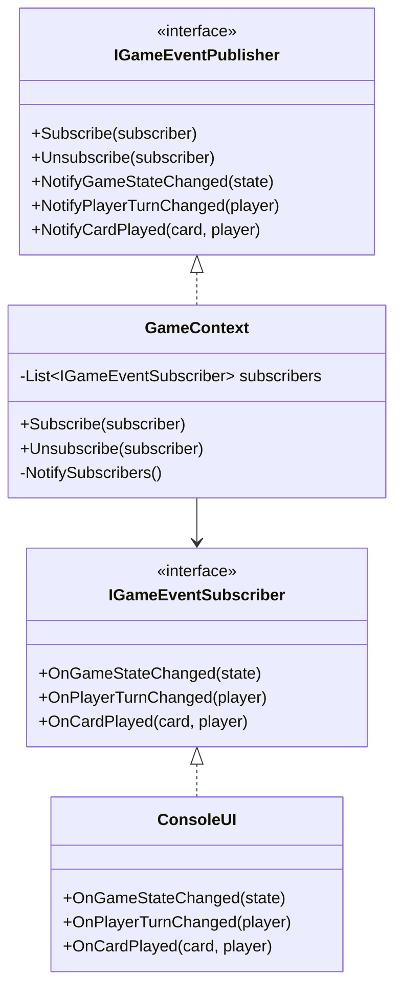
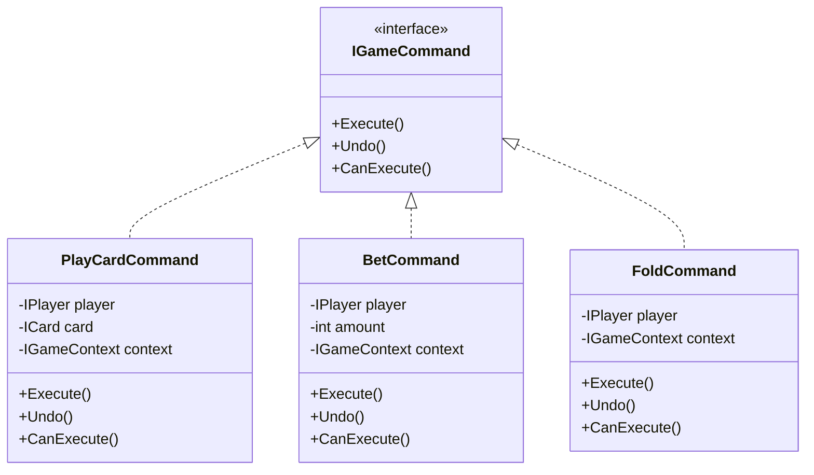
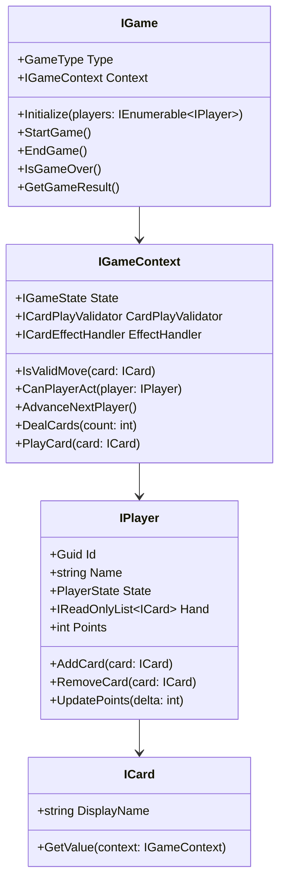
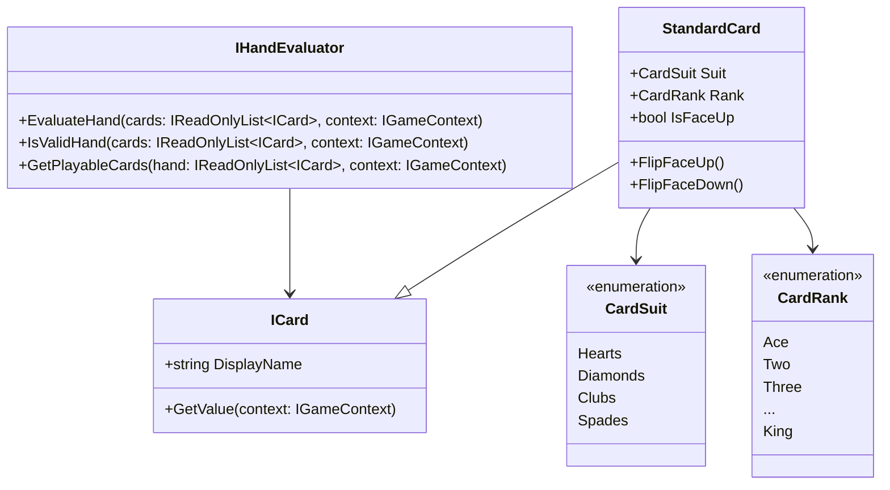
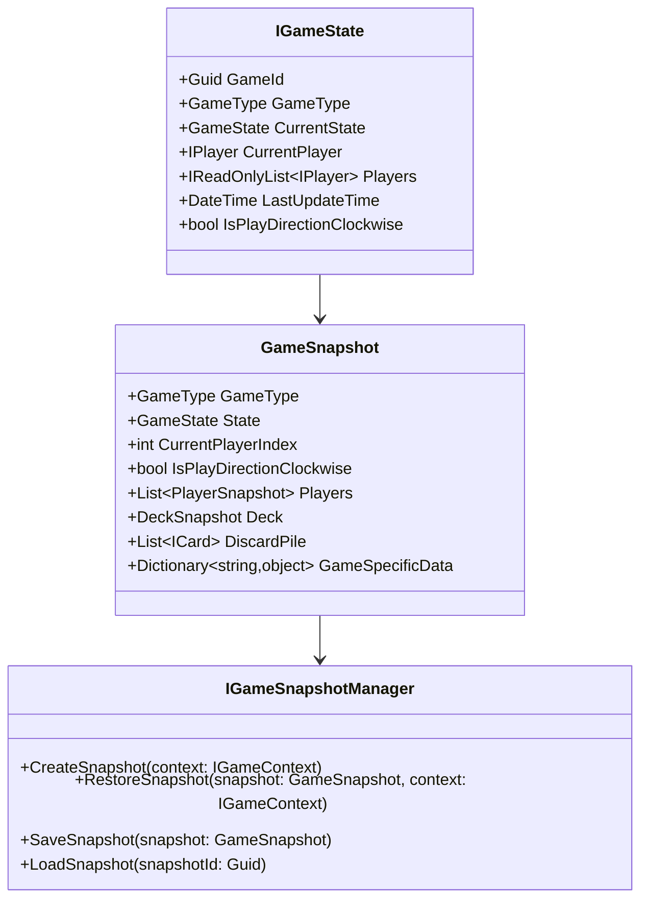

# Card Games Framework

A flexible and extensible .NET framework for implementing various card games using Clean Architecture and Domain-Driven Design principles. The framework currently supports multiple card games including Blackjack, Poker, Uno, and Baccarat.

## Architecture Overview

This project follows Clean Architecture principles with Domain-Driven Design (DDD) at its core. The solution is structured in layers, with clear separation of concerns and dependencies flowing inward.

### Project Structure

```
src/
├── BellotaLabInterview.Core/           # Core Domain Layer
│   ├── Domain/                         # Domain Models and Interfaces
│   │   ├── Cards/                      # Card-related domain objects
│   │   ├── Game/                       # Game-related domain objects
│   │   ├── Players/                    # Player-related domain objects
│   │   └── Snapshots/                  # Game state snapshot system
│   └── Services/                       # Domain Services
├── BellotaLabInterview.Infrastructure/ # Infrastructure Layer
│   └── DependencyInjection/           # DI Configuration
├── Game-Specific Implementations/      # Individual Game Implementations
│   ├── BellotaLabInterview.Blackjack/
│   ├── BellotaLabInterview.Poker/
│   ├── BellotaLabInterview.Uno/
│   └── BellotaLabInterview.Baccarat/
└── BellotaLabInterview.UI.Console/    # Presentation Layer
```

### Architectural Patterns

1. **Clean Architecture**
   - Core Domain is independent of external concerns
   - Dependencies flow inward
   - Interfaces defined in the domain layer
   - Implementations provided in outer layers

2. **Domain-Driven Design (DDD)**
   - Rich domain model with business logic
   - Value Objects for immutable concepts
   - Aggregates for consistency boundaries
   - Domain Events for cross-boundary communication

3. **SOLID Principles**
   - Single Responsibility Principle
   - Open/Closed Principle
   - Liskov Substitution Principle
   - Interface Segregation Principle
   - Dependency Inversion Principle

### Design Patterns Used

1. **Template Method Pattern**
   - `GameBase` abstract class provides the skeleton algorithm for game flow
   - Specific games override methods like `ValidatePlayers`, `InitializeGameState`, `DealInitialCards`
   - Ensures consistent game lifecycle while allowing game-specific variations

2. **Strategy Pattern**
   - `IHandEvaluator` for different card evaluation strategies
   - `ICardPlayValidator` for game-specific card play rules
   - Easily swap strategies without modifying game logic

3. **Observer Pattern**
   - Game state changes notify interested components
   - Players receive updates about game progression
   - UI components react to game state changes

4. **Factory Pattern**
   - `ICardFactory` creates game-specific card implementations
   - Encapsulates card creation logic
   - Supports different card types for different games

5. **Memento Pattern**
   - `GameSnapshot` system for saving/restoring game state
   - Enables undo/redo functionality
   - Supports game serialization and persistence

6. **Command Pattern**
   - Player actions are encapsulated as commands
   - Enables action validation, logging, and undo/redo
   - Simplifies implementation of complex game rules

### Design Pattern Implementations

#### Template Method Pattern Implementation



#### Strategy Pattern Implementation



#### Factory Pattern Implementation



#### Observer Pattern Implementation



#### Command Pattern Implementation



### Component Responsibilities

#### Core Components

1. **Game Engine (`GameBase`)**
   - Manages game lifecycle
   - Coordinates player turns
   - Enforces game rules
   - Handles state transitions
   - Example: `BlackjackGame`, `PokerGame`

2. **Game Context (`IGameContext`)**
   - Maintains current game state
   - Provides access to game services
   - Manages player interactions
   - Handles event publishing
   - Example: `GameContext`

3. **Card System (`ICard`, `ICardFactory`)**
   - Defines card behaviors
   - Creates game-specific cards
   - Manages card collections
   - Example: `StandardCard`, `UnoCard`

4. **Player Management (`IPlayer`)**
   - Tracks player state
   - Manages player hands
   - Handles player actions
   - Example: `Player`

#### Service Components

1. **Hand Evaluation (`IHandEvaluator`)**
   - Evaluates card combinations
   - Determines winning hands
   - Validates card plays
   - Example: `PokerHandEvaluator`

2. **Game Rules (`IGameRules`)**
   - Defines game-specific rules
   - Validates game actions
   - Controls game flow
   - Example: `BlackjackRules`

3. **State Management (`IGameState`, `GameSnapshot`)**
   - Tracks game progression
   - Enables state persistence
   - Supports undo/redo
   - Example: `GameStateManager`

4. **Event System (`IGameEventPublisher`)**
   - Notifies state changes
   - Coordinates UI updates
   - Manages subscriptions
   - Example: `GameEventManager`

#### Infrastructure Components

1. **Dependency Injection**
   - Manages object creation
   - Configures services
   - Handles lifetime scope
   - Example: `GameServiceCollection`

2. **Logging and Monitoring**
   - Tracks game events
   - Records player actions
   - Enables debugging
   - Example: `GameLogger`

3. **Error Handling**
   - Manages exceptions
   - Provides error recovery
   - Ensures game stability
   - Example: `GameExceptionHandler`

### Component Interactions

1. **Game Flow**
   ```mermaid
   sequenceDiagram
       participant Game
       participant Context
       participant Player
       participant HandEvaluator
       
       Game->>Context: Initialize Game
       Context->>Player: Setup Players
       loop Game Round
           Game->>Context: Start Round
           Context->>Player: Deal Cards
           loop Player Turn
               Player->>Context: Play Card
               Context->>HandEvaluator: Validate Play
               HandEvaluator-->>Context: Validation Result
               Context-->>Player: Action Result
           end
           Game->>HandEvaluator: Evaluate Round
           HandEvaluator-->>Game: Round Result
       end
   ```

2. **State Management Flow**
   ```mermaid
   sequenceDiagram
       participant Game
       participant Context
       participant StateManager
       participant EventPublisher
       
       Game->>Context: Request State Change
       Context->>StateManager: Validate Transition
       StateManager-->>Context: Validation Result
       Context->>StateManager: Create Snapshot
       Context->>EventPublisher: Notify State Change
       EventPublisher->>Subscribers: Broadcast Update
   ```

## Class Diagrams

### Core Domain Model



### Card System



### Game State Management



### Extending the Framework

#### Creating a New Card Game

1. **Create a New Project**
   ```
   BellotaLabInterview.[GameName]/
   ├── Cards/
   │   ├── [GameName]Card.cs
   │   └── [GameName]CardFactory.cs
   ├── Game/
   │   ├── [GameName]Game.cs
   │   ├── [GameName]GameContext.cs
   │   └── [GameName]GameRules.cs
   └── Services/
       └── [GameName]GameService.cs
   ```

2. **Implement Core Interfaces**
   - Extend `GameBase` for game flow
   - Implement `IHandEvaluator` for card evaluation
   - Create game-specific card types if needed

3. **Define Game Rules**
   ```csharp
   public class [GameName]GameRules : GameRulesBase
   {
       public override int MinPlayers => [number];
       public override int MaxPlayers => [number];
       public override int InitialHandSize => [number];
       
       public override Task<bool> IsValidMove(IPlayer player, ICard card, IGameContext context)
       {
           // Implement game-specific move validation
       }
       
       // Override other methods as needed
   }
   ```

4. **Register Dependencies**
   ```csharp
   services.AddScoped<IGame, [GameName]Game>();
   services.AddScoped<IGameRules, [GameName]GameRules>();
   services.AddScoped<IHandEvaluator, [GameName]HandEvaluator>();
   ```

## Getting Started

1. Clone the repository
2. Open the solution in Visual Studio 2022 or later
3. Restore NuGet packages
4. Build the solution
5. Run the Console UI project to start playing

## Requirements

- .NET 9.0
- Visual Studio 2022 or later

## Contributing

1. Fork the repository
2. Create a feature branch
3. Commit your changes
4. Push to the branch
5. Create a Pull Request

## License

This project is licensed under the MIT License - see the LICENSE file for details