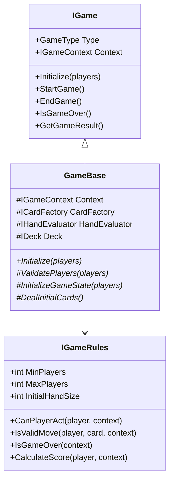
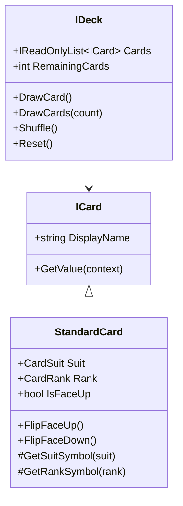
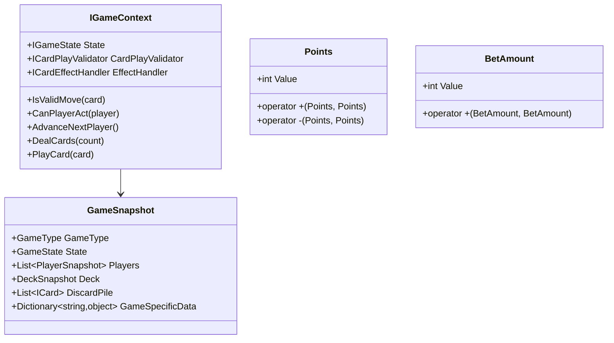
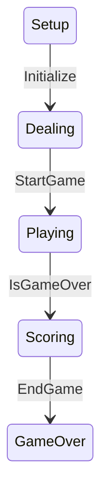
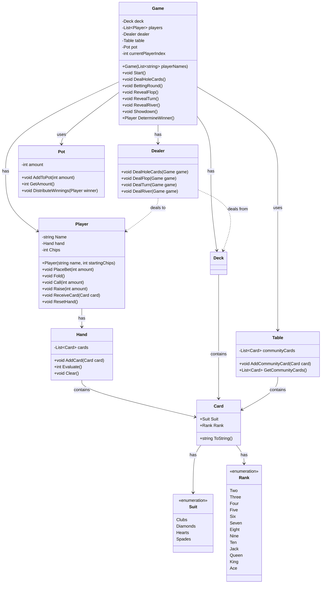
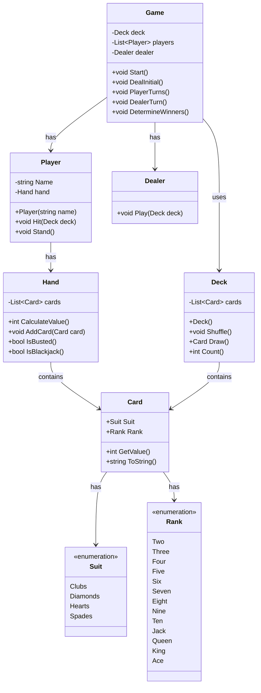
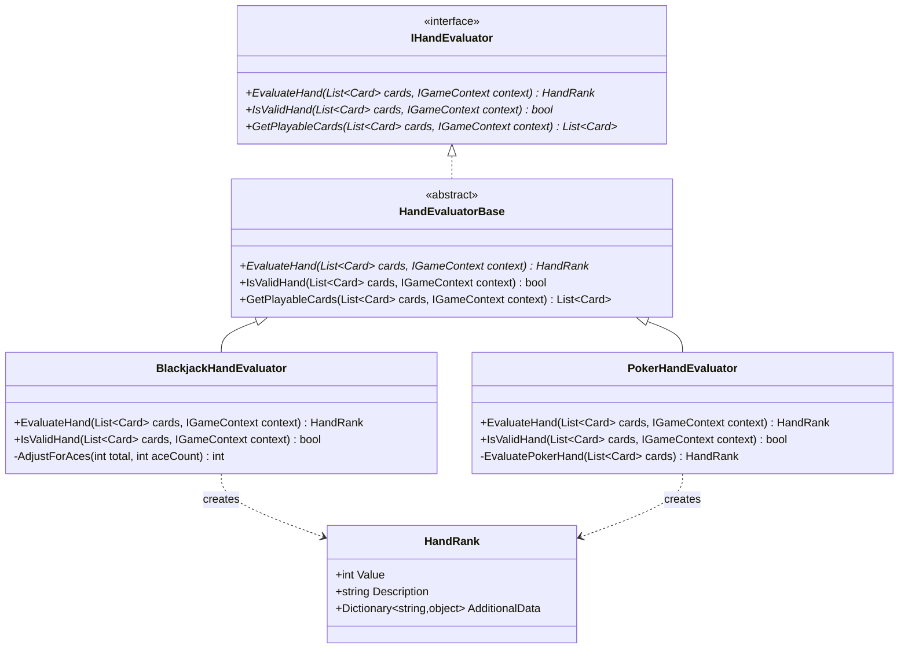
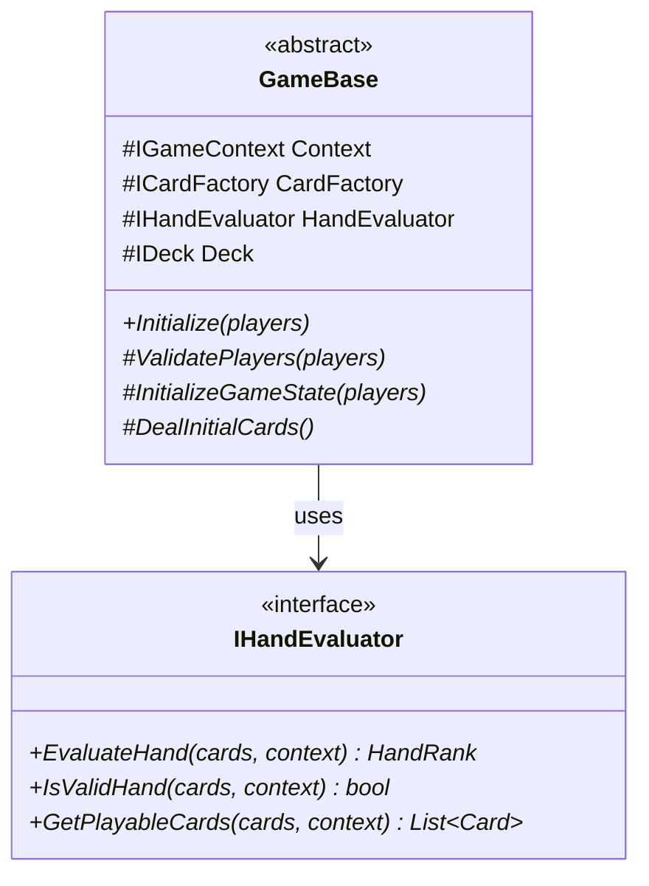

# Card Games Framework

A .NET framework for implementing various card games using Clean Architecture and Domain-Driven Design principles. The framework currently supports multiple card games including Blackjack, Poker, Uno, Baccarat, and High Stakes variants.

## Architecture Overview

The solution follows Clean Architecture with Domain-Driven Design (DDD) principles, organized into distinct layers:

### Core Domain Layer (BellotaLabInterview.Core)

The heart of the system, containing all domain models and business logic:

```
BellotaLabInterview.Core/
├── Domain/
│   ├── Cards/           # Card-related domain objects and interfaces
│   ├── Game/            # Core game abstractions and rules
│   ├── Players/         # Player management and state
│   └── Snapshots/      # Game state persistence
└── Services/           # Domain services
```

### Game Implementations

Each game is implemented in its own project, extending the core domain:

```
BellotaLabInterview.Blackjack/
BellotaLabInterview.Poker/
BellotaLabInterview.Uno/
BellotaLabInterview.Baccarat/
BellotaLabInterview.HighStakes/
```

### Infrastructure Layer

Handles cross-cutting concerns and dependency injection:

```
BellotaLabInterview.Infrastructure/
└── DependencyInjection/  # Service registration and configuration
```

### Presentation Layer

```
BellotaLabInterview.UI.Console/  # Console-based user interface
```

## Core Domain Model

### Game Components



### Card System



### State Management



## Design Patterns Used

1. **Template Method Pattern**
   - `GameBase` provides the game flow skeleton with abstract methods:
     - `ValidatePlayers(players)`
     - `InitializeGameState(players)`
     - `DealInitialCards()`
     - `StartFirstTurn()`
     - `CleanupGame()`
   - Concrete games like `BlackjackGame` implement specific behaviors

2. **Strategy Pattern**
   - `IHandEvaluator` for different card evaluation rules
     - `BlackjackHandEvaluator` handles Ace values (1 or 11)
     - Each game implements its own hand evaluation logic
   - `IGameRules` for game-specific rules
     - Defines player constraints (min/max players)
     - Controls turn validation and move validation
     - Handles game state transitions
     - Implements scoring and winner determination

3. **Value Objects**
   - `Points` for immutable point values
     - Ensures non-negative values
     - Provides arithmetic operations
   - `BetAmount` for betting operations
     - Ensures positive bet values
     - Supports comparison operations
   - `GameSnapshot` for state persistence
     - Captures complete game state
     - Supports save/restore functionality

4. **Factory Pattern**
   - `ICardFactory` for creating game-specific cards
   - Each game implements its own card factory:
     - `BlackjackCardFactory` for standard 52-card deck
     - `UnoCardFactory` for Uno-specific cards

5. **Observer Pattern** (via Event Handlers)
   - `ICardEffectHandler` for handling card effects
   - `ICardPlayValidator` for validating card plays

## Game State Machine

The framework implements a state machine for game flow:



## Card Representation

The framework provides a flexible card system:

- **Standard Cards**
  - Unicode symbols for suits (♥, ♦, ♣, ♠)
  - Fallback ASCII symbols (<3, <>, (), ^)
  - Face up/down state management
  - Rank values (Ace=1/11, Face cards=10)

## Dependency Injection

Services are registered in the Infrastructure layer:

```csharp
public static IServiceCollection AddBellotaLabServices(this IServiceCollection services)
{
    return services
        .AddCoreServices()
        .AddUnoServices()
        .AddBlackjackServices()
        .AddHighStakesServices();
}
```

Game-specific registrations:

```csharp
private static IServiceCollection AddBlackjackServices(this IServiceCollection services)
{
    services.AddScoped<ICardFactory, BlackjackCardFactory>();
    services.AddScoped<IHandEvaluator, BlackjackHandEvaluator>();
    services.AddScoped<IDeck, BlackjackDeck>();
    services.AddScoped<IGameRules, BlackjackGameRules>();
    services.AddScoped<IGame, BlackjackGame>();
    return services;
}
```

## Poker Game Structure



## Blackjack Game Structure



## Hand Evaluation System



## Game Base Structure



## Requirements

- .NET 9.0
- Visual Studio 2022 or later

## Getting Started

1. Clone the repository
2. Open the solution in Visual Studio
3. Build the solution
4. Run the Console UI project

## License

This project is licensed under the MIT License